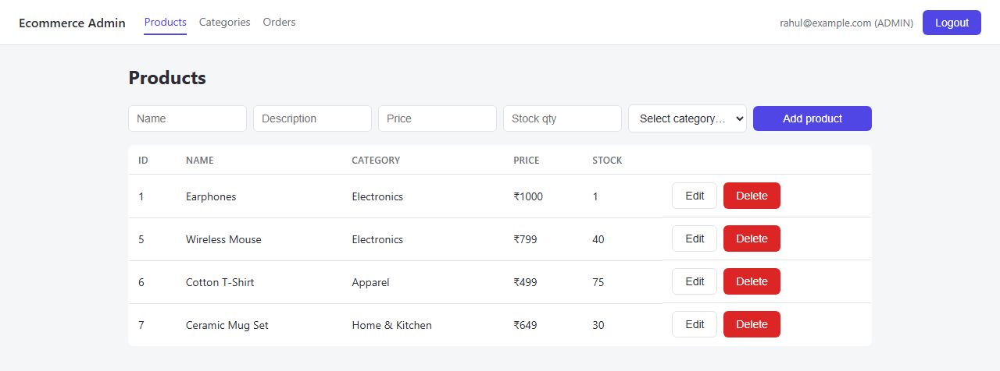
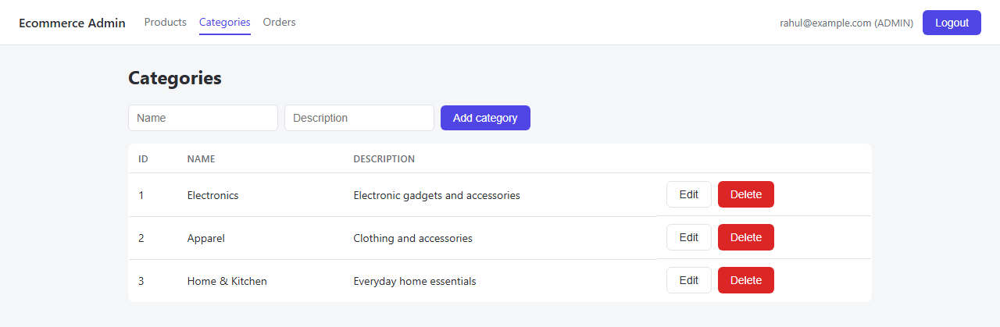

# E-Commerce Platform

A full-stack e-commerce application: a Spring Boot REST API backend and a
React admin panel for managing it.

## 🔗 Live demo

| | |
|---|---|
| **Admin panel** | **[ecommerce-platform-one-fawn.vercel.app](https://ecommerce-platform-one-fawn.vercel.app/login)** |
| **API** | **[ecommerce-platform-nfsa.onrender.com](https://ecommerce-platform-nfsa.onrender.com/api/products)** |
| **API docs (Swagger)** | **[.../swagger-ui/index.html](https://ecommerce-platform-nfsa.onrender.com/swagger-ui/index.html)** |
| **Demo login** | `rahul@example.com` / `password123` (ADMIN — feel free to poke at it; it's a demo DB) |

> The backend is on Render's free tier and spins down after inactivity — the
> first request after a while can take 30–60s to wake back up. Not a bug.

<p>
  
  
</p>

| | |
|---|---|
| **[`/backend`](backend)** | Spring Boot 3.3.4 · Java 17 · PostgreSQL · JWT auth · Swagger UI |
| **[`/frontend`](frontend)** | React 19 · Vite · admin panel for products/categories/orders |

## What it does

- **Auth** — registration/login issuing JWTs, BCrypt-hashed passwords,
  stateless sessions
- **Catalog** — products and categories, public to browse, admin-only to
  manage (via the admin panel or directly against the API)
- **Cart & orders** — per-user cart with stock checks, order placement,
  admin order-status updates
- **Role-based authorization** — `CUSTOMER` vs `ADMIN`, enforced at the API
  layer

## Architecture at a glance

```
Browser (React admin panel)
        │  /api/* — proxied in dev, VITE_API_URL in production
        ▼
Spring Boot API
   Controller → Service → Repository → Entity
        │
        ▼
   PostgreSQL
```

Locally that's Vite's dev server (`:5173`) → Spring Boot (`:8080`) → your
local `ecommerce_db`. In production it's Vercel → Render → Neon — same
shape, different hosts (see [Deployment](#deployment) below).

Every request that isn't `/api/auth/**` or a public `GET` on products/
categories passes through a JWT filter that verifies the token's signature
and rebuilds Spring Security's authorization context — there's no
server-side session store to check against.

## Deployment

| | |
|---|---|
| Frontend | [Vercel](https://vercel.com) — static build of `frontend/`, `VITE_API_URL` set at build time |
| Backend | [Render](https://render.com) — Docker web service built from [`backend/Dockerfile`](backend/Dockerfile) |
| Database | [Neon](https://neon.tech) — free serverless PostgreSQL |

The backend reads `DB_URL`/`DB_USERNAME`/`DB_PASSWORD`/`JWT_SECRET`/
`CORS_ALLOWED_ORIGINS` from environment variables (see
[`backend/README.md`](backend/README.md#configuration)) — nothing
environment-specific is hardcoded, so the same image runs locally or on
Render unchanged.

## Running it locally

Both halves need to run at once. See each project's own README for full
detail:

1. **[Backend setup](backend/README.md)** — create the Postgres database,
   configure env vars if needed, `mvn spring-boot:run`
2. **[Frontend setup](frontend/README.md)** — `npm install && npm run dev`,
   with the backend already running

## Known limitations

See the backend and frontend READMEs for the full list — the headline ones:
no endpoint to list orders across all customers (admin can only act on a
specific order by ID), and test coverage is backend service-layer only.
