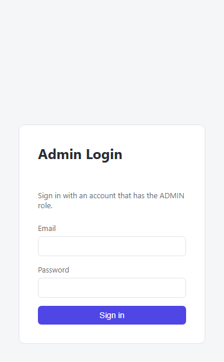

# ecommerce-admin-panel

A React admin panel for managing the e-commerce catalog and orders — consumes
the [backend API](../backend) over HTTP. Built with React 19 and Vite.

<p>
  
  
</p>

## Features

- Login gated to `ADMIN`-role accounts, JWT stored in `localStorage`
- Products — create, edit, delete, paginated list
- Categories — create, edit, delete
- Orders — look up a specific order by ID and update its status; view your
  own placed orders

## Getting started

### Prerequisites

- Node.js 18+ and npm
- The backend running at `http://localhost:8080` (see [`../backend`](../backend))

### Run it

```bash
npm install
npm run dev
```

Opens at `http://localhost:5173`. In development, Vite proxies every
`/api/*` request straight to `http://localhost:8080` (see
[`vite.config.js`](vite.config.js)), so the browser sees same-origin
requests and no CORS setup is needed locally.

## Project structure

```
src/
├── api/
│   └── client.js       axios instance — attaches the JWT to every request
├── context/
│   └── AuthContext.jsx login/logout state, persisted to localStorage
├── components/
│   ├── ProtectedRoute.jsx   redirects to /login unless authenticated as ADMIN
│   └── Layout.jsx           top nav + page shell
├── pages/
│   ├── Login.jsx
│   ├── Products.jsx
│   ├── Categories.jsx
│   └── Orders.jsx
└── App.jsx              route definitions
```

## Known limitations

- The Orders page can't list every order across all customers — the backend
  only exposes "my orders" and "look up by ID" (see the backend README for
  why). Managing a specific customer's order requires already knowing its ID.
- No build/deploy pipeline configured yet — `npm run build` produces a static
  `dist/` you'd need to host somewhere (e.g. Vercel, Netlify) for a live demo
  link.
